# AI, GenAI, and Agentic Systems: A Comprehensive Overview

---

## Slide 1: Title Slide

# AI, Generative AI & Agentic Systems
## Framework Comparison & Evaluation Strategies

**A Comprehensive Technical Overview - 2026**

Prepared for: Technical Team Presentation

---

## Slide 2: What is AI and Generative AI?

### Traditional AI vs. Generative AI

**Traditional AI (Discriminative AI)**
- Rule-based expert systems
- Classification and prediction
- Pattern recognition from existing data
- Examples: Spam filters, fraud detection, recommendation systems

**Generative AI (GenAI)**
- Creates new content across modalities (text, images, video, audio)
- Foundation models trained on massive datasets
- Transformers and large-scale neural networks
- Examples: GPT-4, Claude, Gemini, DALL-E, Stable Diffusion

### 2026 Key Trends
✨ **Multimodal Integration** - Seamless text, image, audio, video processing  
🤖 **Agentic Capabilities** - Proactive, autonomous task completion  
🎯 **Domain Specialization** - Industry-specific fine-tuned models  
⚡ **Edge AI** - On-device inference for privacy and speed  
📊 **Hyper-personalization** - Real-time adaptive user experiences

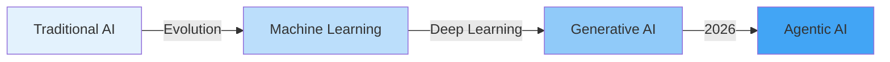

---

## Slide 3: Understanding Agentic AI Systems

### What are AI Agents?

**AI Agents** are autonomous systems that can:
- 🎯 **Reason** - Analyze situations and make decisions
- 📋 **Plan** - Break down complex tasks into steps
- 🔧 **Act** - Execute tasks using available tools
- 🔄 **Learn** - Improve from feedback and experience
- 🤝 **Collaborate** - Work with other agents and humans

### Core Components

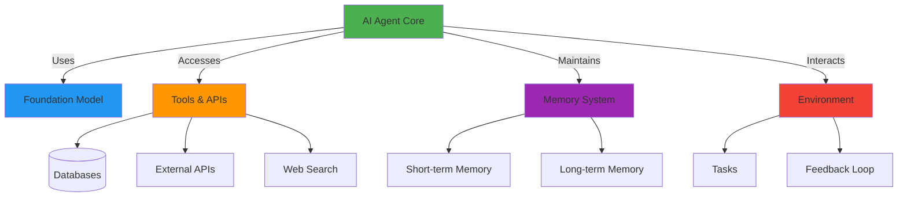

### Multi-Agent Systems

- **Orchestration** - Coordinating specialized agents for complex workflows
- **Collaboration Patterns** - Swarm, hierarchical, workflow-based
- **Role Specialization** - Each agent has specific expertise
- **2026 Prediction**: 70% of MAS will feature narrow, focused roles

---

## Slide 4: Agentic System Architecture

### Production-Ready Agent Architecture

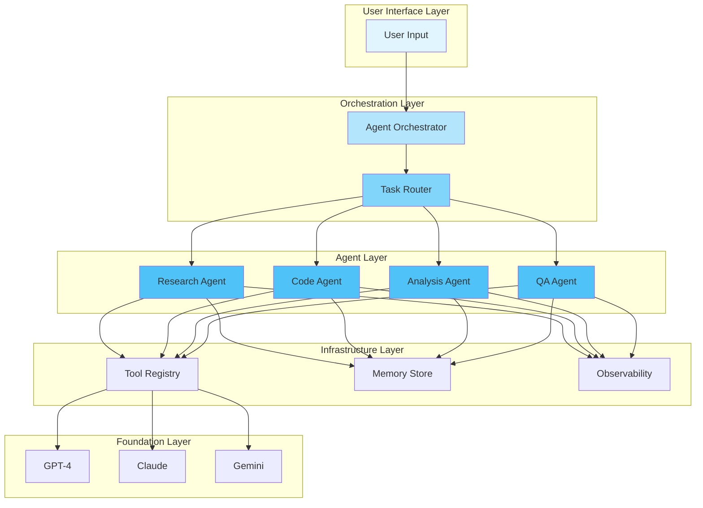

### Key Capabilities (2026)

- **Governance-First Design** - Permission boundaries, audit logs
- **Human-in-the-Loop** - Approval checkpoints for critical decisions
- **Full Process Automation** - End-to-end workflow execution
- **Proactive Intelligence** - Predictive "next best action" suggestions

---

## Slide 5: AI Evaluation Frameworks

### Why Evaluation Matters

**2026 Shift**: From "Can AI do this?" to "**How well, at what cost, and for whom?**"

### Evaluation Pillars

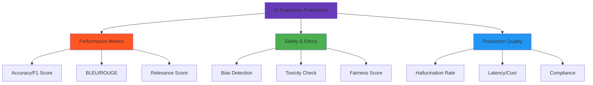

### Key Evaluation Metrics

**Accuracy Metrics**
- Precision, Recall, F1 Score
- Exact Match, Semantic Similarity

**LLM-Specific Metrics**
- **Hallucination Detection** - Factual correctness
- **Contextual Relevance** (RAG) - Faithfulness to source
- **Conversational Quality** - Coherence, helpfulness

**Agentic Metrics**
- Tool Usage Accuracy
- Multi-turn Reasoning Quality
- Task Success Rate

---

## Slide 6: Leading Evaluation Platforms

### Enterprise-Grade Evaluation Tools (2026)

| Platform | Strengths | Best For |
|----------|-----------|----------|
| **DeepEval** | Developer-focused, Pytest integration, RAG metrics | Development & Testing |
| **Galileo AI** | Hallucination detection, near-human accuracy | Production GenAI Apps |
| **Arize** | ML observability, drift detection, compliance | Enterprise Monitoring |
| **Patronus AI** | Rubric-based scoring, safety checks | Structured Evaluation |
| **MLflow** | Experiment tracking, metrics logging | Custom Workflows |
| **RAGAS** | RAG-specific evaluation | RAG Systems |
| **Braintrust** | Dev workflow integration, observability | End-to-End Platform |

### Emerging Practices

✅ **LLM-as-a-Judge** - Using advanced LLMs to evaluate other models  
✅ **Traceability** - Linking scores to specific prompt/model/dataset versions  
✅ **Continuous Monitoring** - Real-time production performance tracking  
✅ **Component-Level Testing** - Evaluating RAG retrievers, rankers separately  
✅ **Regulatory Compliance** - EU AI Act, privacy regulations built-in

---

## Slide 7: Strands SDK Framework

### Overview

**Strands Agents** is an **open-source, code-first Python framework** by AWS for building production-ready AI agents.

### Key Features

🎯 **Simplicity** - Minimal boilerplate, opinionated design  
🔄 **Model Agnostic** - Works with Bedrock, OpenAI, Anthropic, Google  
🏗️ **Production-Ready** - Built-in observability, tracing, deployment  
🤖 **Multi-Agent Support** - Swarm, Graph, Workflow patterns  
⚡ **AWS Integration** - Seamless with Bedrock, Lambda, Step Functions

### Architecture

```mermaid
graph LR
    App[Your Application]
    App --> Strands[Strands Agent]
    
    Strands --> Loop[Agent Loop]
    Strands --> Tools[Tool Registry]
    Strands --> Memory[Memory Manager]
    
    Loop --> Models[Model Providers]
    Models --> Bedrock[AWS Bedrock]
    Models --> OpenAI[OpenAI]
    Models --> Anthropic[Anthropic]
    
    Tools --> Custom[Custom Tools]
    Tools --> Community[Community Tools]
    
    Memory --> Auto[Auto Memory]
    Memory --> Conv[Conversational]
    
    style Strands fill:#ff9900
    style Loop fill:#146eb4
    style Tools fill:#232f3e
    style Memory fill:#ec7211
```

### Quick Start

```python
from strands_agents import Agent
from strands_agents.models import BedrockModel

# Create agent with Bedrock
agent = Agent(
    model=BedrockModel(model_id="anthropic.claude-v3"),
    tools=[search_tool, database_tool],
    memory=True
)

# Invoke agent
response = agent.invoke("Analyze Q4 sales trends")
```

### Use Cases
- Autonomous incident resolution (SRE)
- Multi-step workflow automation
- Research and analysis agents
- Customer support orchestration

---

## Slide 8: AWS Agent Core Platform

### Amazon Bedrock AgentCore

**AWS Agent Core** is an **agentic platform** for building, deploying, and operating AI agents securely at scale.

### Core Services

```mermaid
graph TB
    subgraph AgentCore["AWS Bedrock AgentCore Platform"]
        Runtime[Runtime Service]
        Memory[Memory Service]
        Gateway[Gateway Service]
        Identity[Identity Service]
        Tools[Built-in Tools]
        Obs[Observability]
        Policy[Policy Engine]
    end
    
    subgraph Frameworks["Compatible Frameworks"]
        Strands[Strands Agents]
        LG[LangGraph]
        Crew[CrewAI]
        Llama[LlamaIndex]
    end
    
    subgraph Models["Foundation Models"]
        Nova[Amazon Nova]
        Claude[Anthropic Claude]
        Llama2[Meta Llama]
        Mistral[Mistral AI]
    end
    
    Frameworks --> Runtime
    Runtime --> Models
    Runtime --> Memory
    Runtime --> Gateway
    Runtime --> Obs
    
    style AgentCore fill:#ff9900
    style Runtime fill:#146eb4
    style Memory fill:#ec7211
    style Frameworks fill:#232f3e
    style Models fill:#527fff
```

### Key Capabilities

**Runtime**
- Serverless, scalable execution environment
- True session isolation
- Real-time and asynchronous invocations
- Multi-modal/multi-agent workloads

**Memory**
- Short-term (conversation) and long-term (persistent)
- Shared memory stores across agents
- Context-aware experiences

**Observability**
- Production monitoring dashboards
- Performance metrics and quality tracking
- Cost and latency analytics

### Deployment Workflow

1. **Create Agent** - Using CLI or console with framework of choice
2. **Configure Tools** - Define action groups (Lambda, APIs)
3. **Deploy to Runtime** - Serverless deployment
4. **Monitor & Iterate** - Observability and refinement

---

## Slide 9: Framework Comparison

### Leading Agent Frameworks (2026)

| Framework | Philosophy | Architecture | Best For | Learning Curve |
|-----------|------------|--------------|----------|----------------|
| **LangChain / LangGraph** | Modular, flexible | Graph-based state machines | Complex enterprise RAG, custom workflows | Moderate-High |
| **CrewAI** | Role-based teams | Hierarchical/sequential | Content creation, SOP-driven tasks | Easy |
| **AutoGen** | Multi-agent conversation | Dialogue orchestration | Code generation, research, HITL | Moderate |
| **Strands SDK** | Code-first simplicity | Lightweight agent loop | AWS-native production agents | Easy-Moderate |

### Detailed Comparison

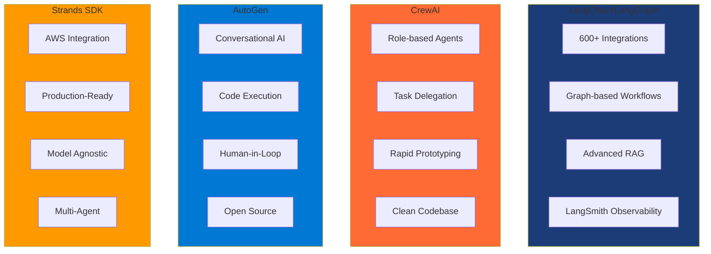

### Selection Criteria

**Choose LangChain/LangGraph if:**
- You need maximum flexibility and customization
- Building complex stateful workflows with loops
- Require extensive ecosystem integrations
- Enterprise-grade observability is critical

**Choose CrewAI if:**
- Rapid prototyping with clear role delegation
- Structured, SOP-driven workflows (content, research)
- Prefer intuitive, easy-to-understand model
- Sequential or hierarchical task execution

**Choose AutoGen if:**
- Code-heavy tasks (generation, debugging)
- Research requiring multi-LLM collaboration
- Human-in-the-loop is first-class requirement
- Experimental/research-oriented projects

**Choose Strands SDK if:**
- Building on AWS infrastructure
- Need production-ready agents quickly
- Want minimal boilerplate with strong defaults
- Require seamless Bedrock integration

---

## Slide 10: Latest LLM Models Comparison (2026)

### Leading Foundation Models

| Vendor | Model | Strengths | Context Window | Key Features |
|--------|-------|-----------|----------------|--------------|
| **OpenAI** | GPT-5.2 | Reasoning, coding, knowledge work | Extended | Multi-tiered family, super-assistant |
| **Anthropic** | Claude Opus 4.6 | Agentic coding, safety, reasoning | 1M tokens (beta) | Computer use, self-correction |
| **Google** | Gemini 3 Pro | Multimodal, integration | 2M tokens | Deep Research, Assistant replacement |
| **AWS** | Amazon Nova | Enterprise, cost-effective | Variable | Bedrock-native, security |
| **Meta** | Llama 3+ | Open-source, customizable | Variable | On-prem deployment, fine-tuning |
| **Microsoft** | Copilot (GPT-4) | Productivity integration | Extended | Microsoft 365 deep integration |

### Model Selection Matrix

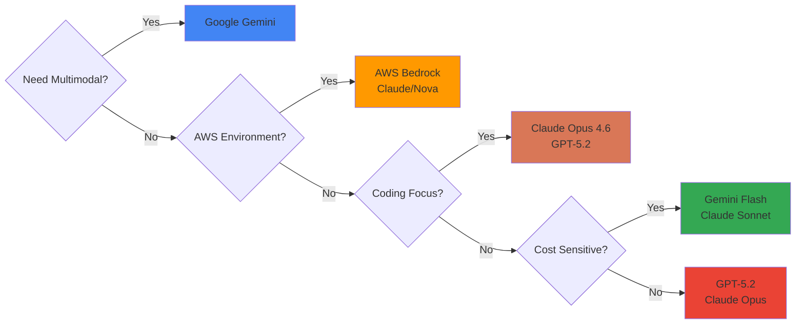

### 2026 Trends

🌟 **Agentic Capabilities Built-In** - Models designed for autonomous task execution  
🎨 **Multimodal by Default** - Text, image, audio, video in single model  
📏 **Massive Context Windows** - 1M-2M tokens standard  
🏢 **Enterprise Focus** - Security, compliance, governance built-in  
💰 **Cost Optimization** - Tiered models (Flash/Sonnet for efficiency)

---

## Slide 11: Cloud AI Services Overview

### Major Cloud Providers - AI Platforms

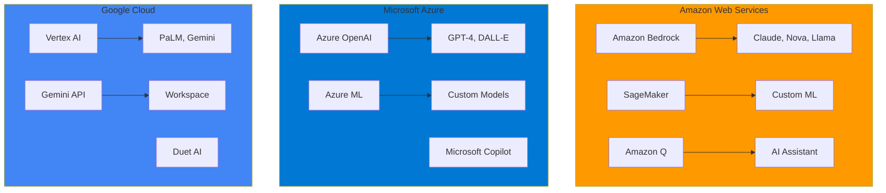

### Service Comparison

| Provider | Platform | Strengths | Agent Support |
|----------|----------|-----------|---------------|
| **AWS** | Bedrock + AgentCore | Security, scale, model choice | ✅ Native AgentCore |
| **Azure** | Azure OpenAI | Enterprise GPT access, M365 integration | ✅ Semantic Kernel |
| **Google** | Vertex AI | Gemini integration, BigQuery | ✅ Agent Builder |

---

## Slide 12: Real-World Use Cases

### Enterprise Agentic AI Applications

**Customer Service & Support**
- Intelligent ticket routing and resolution
- Multi-turn conversation handling
- Knowledge base integration
- 24/7 automated support with escalation

**DevOps & SRE**
- Incident detection and auto-remediation
- Log analysis and root cause identification
- Performance monitoring and optimization
- Infrastructure provisioning automation

**Data & Analytics**
- Automated data pipeline monitoring
- Anomaly detection and alerting
- Natural language to SQL query generation
- Automated report generation

**Software Development**
- Code generation and review
- Bug detection and fixing
- Documentation automation
- Test case generation

**Finance & Compliance**
- Regulatory compliance checking
- Fraud detection patterns
- Risk assessment automation
- Financial report analysis

### Success Metrics

📊 **70% reduction** in resolution time  
💰 **40% cost savings** on manual processes  
⚡ **90% automation** rate for routine tasks  
😊 **35% improvement** in customer satisfaction

---

## Slide 13: Competitor Landscape

### AI Agent Framework Ecosystem

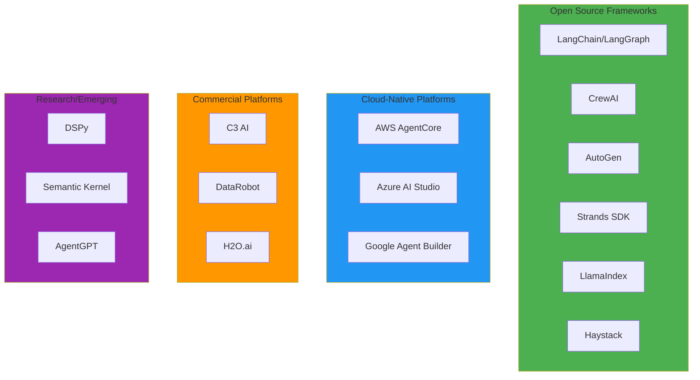

### Market Positioning

**Developer-First (Open Source)**
- LangChain: Ecosystem leader, maximum flexibility
- CrewAI: Fastest time-to-prototype
- AutoGen: Research and experimentation
- Strands: AWS-native simplicity

**Enterprise Platforms**
- AWS AgentCore: Security and scale
- Azure AI Studio: Microsoft ecosystem integration
- Google Agent Builder: Gemini-powered

**Trends**
- 🔄 Convergence on graph-based orchestration
- 🧪 Built-in evaluation and testing
- 🔒 Governance and security by default
- 📈 40% of enterprise apps will embed agents by end of 2026

---

## Slide 14: Best Practices & Recommendations

### Building Production Agents

**1. Start with Clear Scope**
- Define specific tasks and success criteria
- Identify appropriate level of autonomy
- Establish human oversight requirements

**2. Choose the Right Framework**
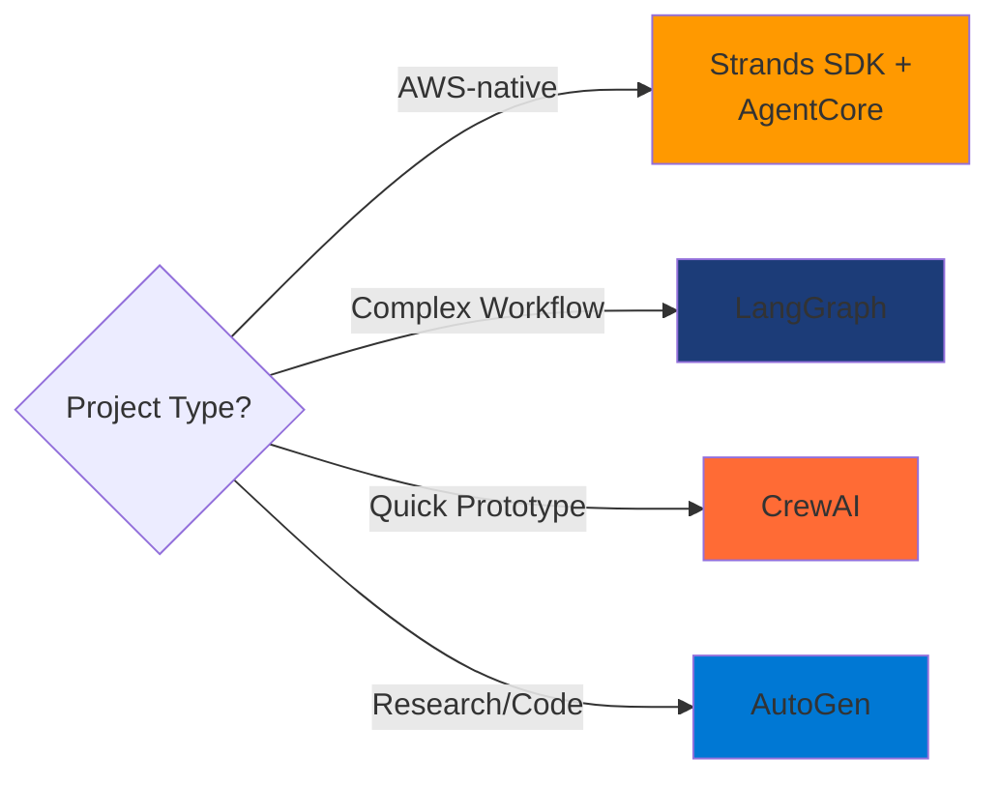

**3. Implement Robust Evaluation**
- Pre-production testing with representative data
- Continuous monitoring in production
- Hallucination and safety checks
- Cost and latency tracking

**4. Governance & Security**
- Define permission boundaries
- Implement audit logging
- Set approval workflows for critical actions
- Regular security assessments

**5. Iterate Based on Metrics**
- Track task success rates
- Monitor tool usage patterns
- Analyze failure modes
- Continuous prompt optimization

### Key Takeaways

✅ **AI agents are moving from experimental to enterprise-critical**  
✅ **Multi-agent orchestration is the future of complex automation**  
✅ **Evaluation and observability are non-negotiable**  
✅ **Choose frameworks based on use case, not hype**  
✅ **Security and governance must be designed in from day one**

---

## Slide 15: Summary & Next Steps

### Summary

**AI Evolution**
- From discriminative AI → Generative AI → **Agentic AI**
- 2026: Focus on multimodal, autonomous, domain-specialized systems

**Agentic Systems**
- Reasoning, planning, acting with tools and memory
- Multi-agent collaboration for complex workflows
- 70% of MAS will have specialized roles by 2027

**Evaluation**
- Shift from innovation to rigorous utility
- Continuous monitoring, traceability, safety checks
- LLM-as-judge, component-level testing

**Frameworks**
- **Strands SDK**: AWS-native, production-ready simplicity
- **LangChain/LangGraph**: Maximum flexibility for complex workflows
- **CrewAI**: Rapid prototyping with role-based design
- **AutoGen**: Multi-agent conversations and code tasks

**Cloud Platforms**
- **AWS AgentCore**: Enterprise agent platform with security
- Model choice across vendors (Claude, Nova, GPT, Gemini)

### Recommended Next Steps

1. **Pilot Project** - Start with a well-defined use case
2. **Framework Selection** - Match framework to requirements
3. **Evaluation Setup** - Implement monitoring from day one
4. **Team Training** - Upskill on chosen framework and best practices
5. **Production Deployment** - Iterative rollout with continuous improvement

### Questions & Discussion

**Contact Information**  
[Your Team/Department]

**Resources**
- Strands SDK: https://strandsagents.com
- AWS AgentCore Docs: https://docs.aws.amazon.com/bedrock
- LangChain: https://langchain.com
- CrewAI: https://crewai.com

---

**Thank you!**
