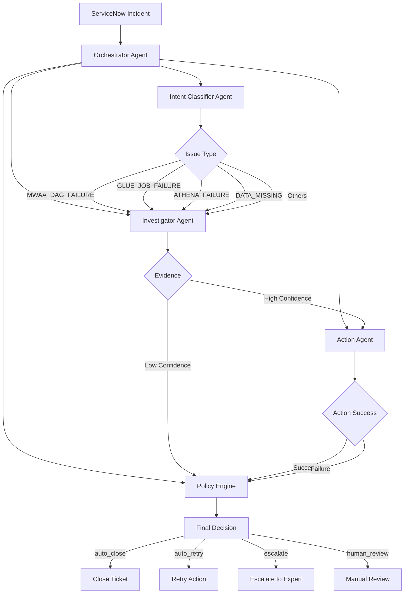

# Orchestrator Agent

## Overview

The **Orchestrator Agent** is the main coordinator for the multi-agent incident handling system. It manages the end-to-end workflow for processing ServiceNow incidents related to AWS data lake infrastructure.

## Architecture



## Issue Types Supported

Based on the incident taxonomy, the orchestrator handles:

| Issue Type | Detected Intent | Tools Used | Suggested Actions |
|------------|----------------|------------|-------------------|
| **MWAA DAG Failure** | `dag_failure`, `dag_alarm`, `mwaa_failure` | `airflow_tool` | 1. Get DAG last runs<br>2. Retrieve error logs<br>3. Retry DAG (max 3)<br>4. Verify upstream files |
| **Glue Job Failure** | `glue_etl_failure` | `glue_tool` | 1. Identify failed run<br>2. Pull logs<br>3. Auto-rerun if safe<br>4. Notify if repeated |
| **Athena Failure** | `athena_failure` | `athena_tool` | 1. Re-test SQL query<br>2. Validate S3 partitions<br>3. Re-run query |
| **Data Missing** | `data_missing`, `data_not_available` | `s3_data_tool`, `watchtower_tool` | 1. Validate expected files<br>2. Identify last available date<br>3. Trigger upstream check |
| **Historical Data Missing** | `source_zero_data` | `s3_data_tool` | 1. Identify all missing days<br>2. Validate data availability |

## Workflow

The orchestrator coordinates the following workflow:

1. **Classification** (Intent Classifier Agent)
   - Analyzes incident description
   - Identifies issue type (MWAA, Glue, Athena, Data Missing, etc.)
   - Returns intent + confidence score

2. **Investigation** (Investigator Agent)
   - Uses appropriate diagnostic tools based on intent
   - Retrieves logs (EMR, Glue, MWAA, CloudWatch, Athena)
   - Verifies data availability
   - Identifies root cause
   - Recommends remediation

3. **Action Execution** (Action Agent)
   - Executes recommended remediation if appropriate
   - Retries failed jobs/queries/DAGs
   - Validates fixes
   - Reports execution results

4. **Policy Decision** (Policy Engine)
   - Evaluates classification confidence + investigation evidence + action results
   - Makes final decision:
     - `auto_close`: High confidence + successful remediation
     - `auto_retry`: Medium confidence + retry recommended
     - `escalate`: Low confidence or complex issues
     - `human_review`: Needs manual intervention

## Usage

### Basic Usage

```python
from agents import orchestrate_incident_sync

# Define incident
incident = {
    "sys_id": "INC001",
    "short_description": "Job SPENDING_POTS has failed Glue ETL failure",
    "category": "Data Pipeline",
    "subcategory": "ETL"
}

# Orchestrate incident handling
result = orchestrate_incident_sync(incident)

# Result contains:
# - classification: intent, confidence, reasoning
# - investigation: findings, root_cause, evidence_score
# - action: action taken, success status
# - decision: final policy decision
```

### Async Usage

```python
from agents import orchestrate_incident

# In async context
result = await orchestrate_incident(incident, mcp_tools=my_tools)
```

### With MCP Tools

```python
from agents import create_orchestrator

# Create orchestrator with MCP tools from Gateway
orchestrator = create_orchestrator(mcp_tools=gateway_tools)

# Orchestrate incident
result = await orchestrator.orchestrate(incident)
```

## API

### `orchestrate_incident(incident, mcp_tools=None)`

Async function to orchestrate complete incident handling.

**Parameters:**
- `incident` (dict): Incident data from ServiceNow with fields:
  - `sys_id`: Incident ID
  - `short_description`: Brief description
  - `description`: Full description (optional)
  - `category`: Category (optional)
  - `subcategory`: Subcategory (optional)
  - `additional_info`: Additional context (optional)
- `mcp_tools` (list, optional): List of MCP tools from Gateway

**Returns:**
- dict: Complete RCA with classification, investigation, action, and decision

### `orchestrate_incident_sync(incident, mcp_tools=None)`

Synchronous wrapper for `orchestrate_incident`.

### `create_orchestrator(mcp_tools=None)`

Factory function to create an OrchestratorAgent instance.

**Parameters:**
- `mcp_tools` (list, optional): List of MCP tools from Gateway

**Returns:**
- `OrchestratorAgent`: Configured orchestrator instance

## Response Structure

```json
{
  "sys_id": "INC001",
  "timestamp": "2026-02-16T09:25:00Z",
  "duration_seconds": 12.5,
  "classification": {
    "intent": "glue_etl_failure",
    "confidence": 0.85,
    "reasoning": "Clear Glue job failure indicators in description"
  },
  "investigation": {
    "findings": [
      {
        "tool": "get_glue_logs",
        "result": {...},
        "summary": "Job exceeded timeout threshold"
      }
    ],
    "root_cause": "Glue job exceeded timeout threshold",
    "evidence_score": 0.75,
    "retry_recommended": true,
    "recommended_action": "retry_glue_job"
  },
  "action": {
    "action": "retry_glue_job",
    "success": true,
    "details": {
      "resource_id": "SPENDING_POTS",
      "new_execution_id": "jr_12345",
      "status": "RUNNING"
    }
  },
  "decision": {
    "decision": "auto_close",
    "score": 0.82,
    "reasoning": "High confidence (0.82) with successful retry",
    "component_scores": {
      "intent_confidence": 0.85,
      "evidence_score": 0.75,
      "action_success": true
    }
  }
}
```

## Configuration

The orchestrator uses configuration from `agents/config.py`:

- `MODEL_ID`: Bedrock model to use (default: Claude Sonnet 4)
- `INTENT_TAXONOMY`: List of supported intents
- `INTENT_TOOL_MAPPING`: Mapping of intents to recommended tools
- `POLICY_OVERRIDES`: Force specific decisions for certain intents
- `POLICY_THRESHOLDS`: Confidence thresholds for decisions

## Testing

Run the test suite:

```bash
python test_orchestrator.py
```

This will test the orchestrator with sample incidents for all issue types.

## Components

The orchestrator integrates with:

1. **Intent Classifier** (`agents/intent_classifier.py`)
   - Classifies incidents into intent categories
   - Returns intent + confidence + reasoning

2. **Investigator** (`agents/investigator.py`)
   - Gathers evidence using MCP Gateway tools
   - Identifies root causes
   - Recommends actions

3. **Action Agent** (`agents/action_agent.py`)
   - Executes retry and validation actions
   - Reports success/failure

4. **Policy Engine** (`agents/policy_engine.py`)
   - Scores evidence quality
   - Applies policy rules
   - Makes final decisions

## Error Handling

The orchestrator includes comprehensive error handling:

- If any agent fails, it returns a human_review decision
- Validation errors are logged but don't crash the workflow
- Mock implementations are used when MCP tools are unavailable
- All errors are captured in the response for debugging

## Future Enhancements

Possible improvements:

1. **Parallel Tool Execution**: Execute multiple diagnostic tools concurrently
2. **Retry Logic**: Add configurable retry strategies for action execution
3. **Learning**: Track successful remediation patterns to improve recommendations
4. **Metrics**: Emit CloudWatch metrics for monitoring orchestrator performance
5. **Caching**: Cache investigation results for similar incidents
